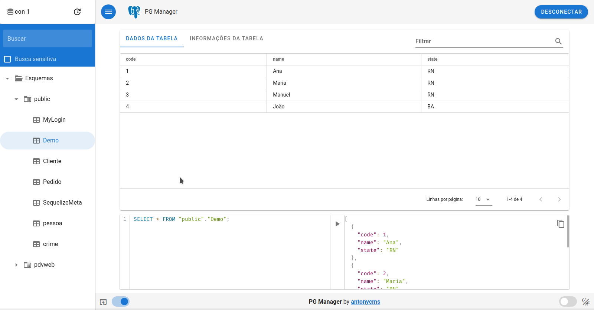
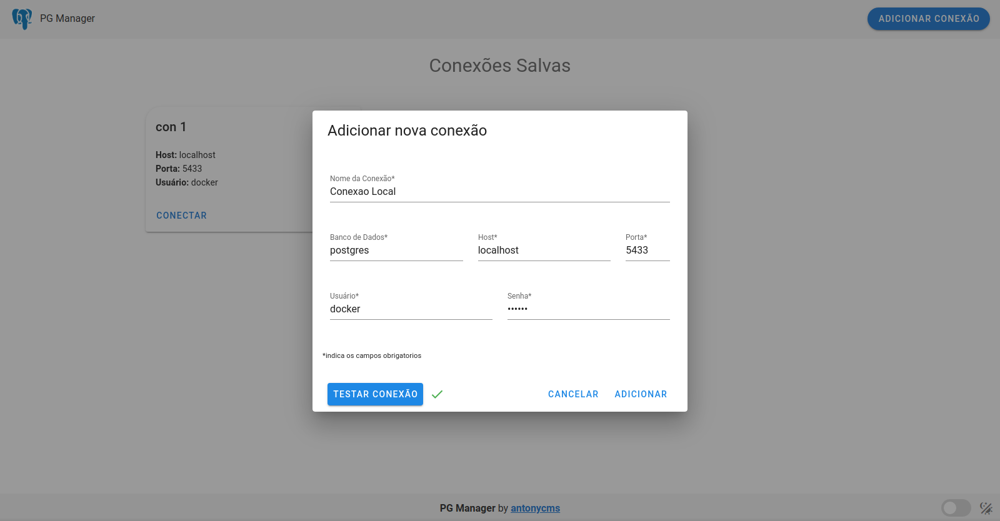
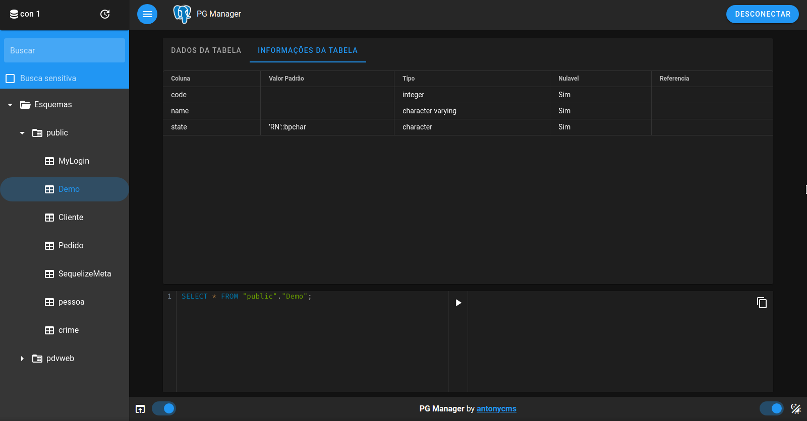

<h1 align="center">PG manager👋</h1>

<p align="center">
  
  
  
  <a href="https://github.com/antonycms/pg-manager#readme" target="_blank">
    
  </a>
  <a href="https://github.com/antonycms/pg-manager/graphs/commit-activity" target="_blank">
    
  </a>
  <a href="https://github.com/antonycms/pg-manager/blob/master/LICENSE" target="_blank">
    
  </a>
</p>

> Um simples gerenciador de banco de dados postgres, feito com VueJS e ElectronJS.

> Possui suporte ao idioma Português e Ingles (De acordo com o idioma do sistema).



### 🏠 [Homepage](https://github.com/antonycms/pg-manager)

## Requisitos
- npm >=6.14.4
- node >=12.17.0

## Tecnologias
- Node
- Vue
- Electron
- Vuex
- Vuetify

## Lints
- Prettier
- Eslint
- Editorconfig

#

## Instalação de dependencias de desenvolvimento
Entre no diretorio `app` e execute o(s) seguinte(s) comando(s):
```sh
yarn install
```
ou
```sh
npm install
```
#
## Rodando o projeto
Entre no diretorio `app` e execute o(s) seguinte(s) comando(s):
```sh
yarn dev
```
ou
```sh
npm run dev
```
#
## Build do App Desktop
Entre no diretorio `app` e execute o(s) seguinte(s) comando(s):
```sh
yarn dist
```
ou
```sh
npm run dist
```
<br/>
<small>A extensão do App gerado podera variar de acordo com o sistema operacional.</small>

#

## Capturas de Tela




#
## 📝 Licença

Copyright © 2020 [Antony Carlos](https://github.com/antonycms).<br />
Este projeto possui licença [MIT](https://github.com/antonycms/pg-manager/blob/master/LICENSE).
